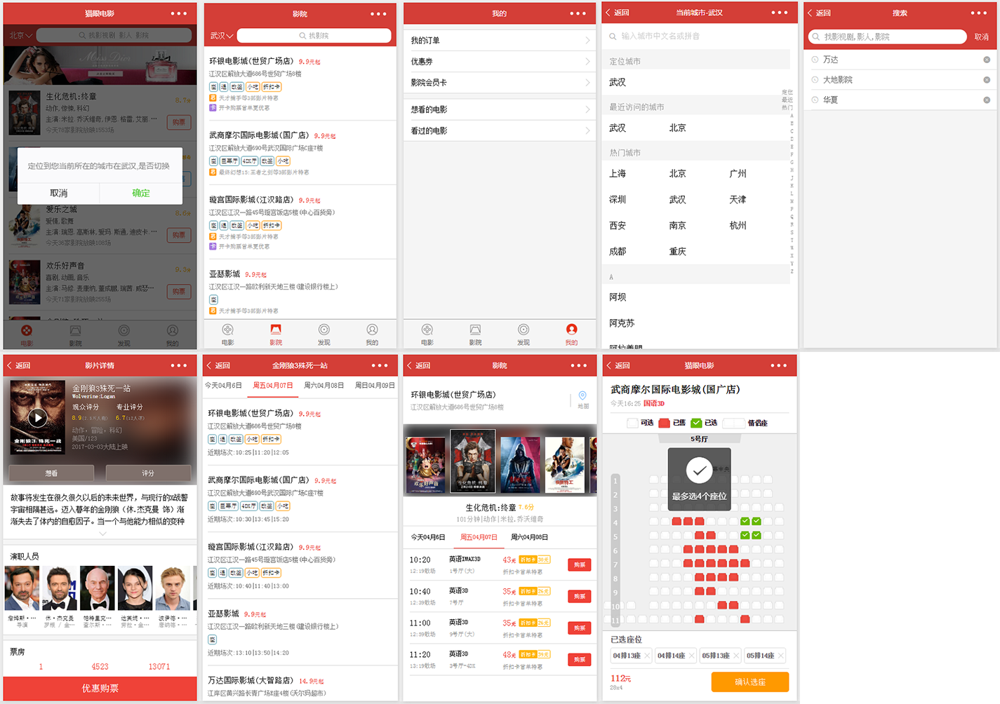

猫眼电影-小程序
-------------------------------------------------------------------
#### 截图

#### 源码简介

```tree
app
├── common
├── img
├── pages
├── utils
├── vendor
├── app.js
├── app.json
├── app.wxss
└── config.js
server
├── db
├── node_modules
├── public
├── schemas
├── views
├── package.json
└── server.js

```
#### 关于微信小程序
* 自从16年9月微信传出要发布一种与公众号一样形态的开放能力——小程序，便密切关注。小程序是除传统web端和APP外一种崭新的服务载体，一时间‘别开发APP了’的声音此起彼伏。本着热爱新奇的技术，对小程序的快捷统一，不需要额外适配各移动端，对开发人员的友好使我格外期盼微信这一新产品的上线。
* 9月22号 小程序内测 第一时间下载了官方开发工具，熟悉开发文档，并和众多互联网从业人员一样好奇小程序的入口在微信的哪里。熟悉和试着开发小程序的各种能力，编写各种小demo。
* 11月3号 小程序公测 拿到了小程序开发资格，这样就能在移动端上预览自己的项目了。继续学习小程序框架，试着把webapp、nativeapp能去粗取精地开发成小程序项目。12月21日：微信小程序开放新增功能：分享，自定义模板消息，客服消息，扫一扫。
* 12月28日，在2017年微信公开课上，张小龙再次现身演讲，解答了外界关于小程序的几大疑惑，包括没有商店、没有微信入口、无法推送消息等，很克制。
* 1月9号 小程序正式上线 入口在‘发现’。
* 3月27日-28日 小程序开放新能力 公众号自定义菜单点击可打开相关小程序，公众号模版消息可打开相关小程序，公众号关联小程序时，可选择给粉丝下发通知，移动App可分享小程序页面，扫描普通链接二维码可打开小程序，低功耗蓝牙，获取用户访问场景等。
* 4月14日开放长按识别二维码功能。

#### 项目总结、重点
**猫眼电影是根据‘猫眼电影app’开发的练习项目，使用自己后台搭建的模拟数据接口。实现了与‘猫眼电影小程序’80%的功能与界面。** 
* 根据小程序框架，合理的使用框架能力，并在需要的时扩展。例如：根据swiper组件扩展为scrolltapnav。   
* 熟悉官方weUI，设计指南（视觉规范，流程规范，清晰明确规范）开发，以免遭到微信的上线拒绝，同时兼顾项目功能界面。  
* 项目中本该从后台实时通信影院，影视数据，由于使用接受后台虚拟数据，在APP端采用页面间通信机制，引入```enent.js```发布监听事件数据，没有使用框架的storage和globaldata,降低耦合度，便于以后的扩展。  
* 框架不采用dom、bom，没有window、document对象，与vue.js很像，单向数据绑定，但又不同。总结：页面的渲染变动，只能{{}}、styleclass、wx:if、hidden。  
* ```app onlanch()...```与```page onload()...```在app、page的生命周期函数中，考虑项目需求，异步回调、合理使用生命周期函数和加标志位能解决这一难点。  
* 小程序规定页面路径最深只能到 5 层。引入```go2Page.js```管理页面跳转，根据需求，合理使用路由得到解决。  
* 小程序包最大1M,模块化、模板、引用、外联样式，```@import、 require、template```将公用的部分抽离，能有效解决，也能方便后期扩展维护。  
* request 的最大并发数是5 ，需要时可以管理。   
* 会话管理 可以用腾讯云的```wafer-client-sdk```。  


